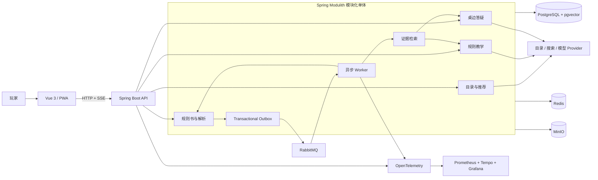

<p align="center">
  
</p>

<h1 align="center">RulePilot</h1>

<p align="center">
  <strong>把规则书变成可核验、可上桌的讲解与答疑。</strong>
</p>

<p align="center">
  RulePilot 是一个证据优先的桌游助手：帮玩家挑选游戏、导入正确版本的规则书，<br>
  生成从摆桌到计分的分步讲解，并让每条规则结论都能回到原始页码核验。
</p>

<p align="center">
  <a href="https://github.com/ZhenFan1996/rulepilot/actions/workflows/ci.yml"></a>
</p>

> [!NOTE]
> **项目状态：活跃开发中。** 本地默认使用确定性的 Fake Provider，不会调用付费模型，也不代表真实模型的质量或延迟。当前发布进度与已验证范围见 [执行状态](docs/roadmap/EXECUTION_STATE.md)。

## 为什么是 RulePilot

桌游规则问题不只是“从 PDF 里找一段相似文字”。真正开桌时，玩家需要确认游戏版本、串起分散在不同页的条件与例外、看懂图示，还要知道证据不足时哪些话不能说。

RulePilot 围绕一条完整的玩家旅程设计：

**挑选游戏 → 绑定正确版本 → 导入规则书 → 生成开桌讲解 → 基于同一证据继续答疑**

它不是一个无边界的通用聊天机器人。规则事实必须绑定文档版本和可访问证据；可选的翻译、视觉增强或模型复核失败时，已经验证并发布的有用内容仍然保留。

## 产品能力

| 场景 | RulePilot 提供什么 |
|---|---|
| 找一款合适的游戏 | 浏览带来源归属的桌游资料；启用对应模型与数据源后，可按人数、时长和互动偏好进行多轮推荐 |
| 导入正确的规则书 | 上传 PDF，或在开启官方来源发现能力后审阅候选来源；文档按游戏、版次和扩展归档 |
| 快速学会开桌 | 按目标、组件、准备、回合、主要行动、结束与计分组织渐进式讲解，而不是输出一整块摘要 |
| 看懂原页与图示 | 引用精确到来源页；可靠的视觉定位可在讲解旁展示相关区域，无法定位时退回普通原页引用 |
| 在桌边继续追问 | 支持基于当前讲解和会话上下文的规则问答；回答通过结构、引用、版本归属和证据范围校验 |
| 管理长时间任务 | 解析、教学和答疑公开真实活动，支持刷新恢复、取消、有限重试和部分结果保留 |
| 分享已发布讲解 | 已发布内容可通过只读页面阅读；用户上传的原始文件继续受身份、所有权和来源边界保护 |

### 可信边界

- **没有证据，不发布规则结论。** 支持的部分正常回答，不支持的部分局部降级，并明确说明不确定性。
- **模型不能决定业务边界。** 意图、实体、工具参数和工作流状态通过带 schema 的工具参数返回，再由应用验证。
- **Agent 是有预算的。** 步数、工具调用、模型调用、Token 和总时限均有上限，并可被用户取消。
- **玩家只看到安全活动。** 流式界面展示检索、核验、失败与下一步，不暴露提示词、凭证或模型私有推理。
- **离线开发是默认路径。** Fake Provider 覆盖普通开发与 CI；真实模型验证必须显式启用并在 CI 之外运行。

## 快速开始

### 环境要求

- Java 21
- Node.js 24 与 npm
- Docker 与 Docker Compose
- Make
- `curl` 与 `jq`（仅完整演示流程需要）

### 1. 获取代码并安装依赖

```bash
git clone git@github.com:ZhenFan1996/rulepilot.git
cd rulepilot
cp .env.example .env
(cd frontend && npm ci)
make bootstrap
```

如果没有配置 GitHub SSH，也可以使用 HTTPS 地址克隆：

```bash
git clone https://github.com/ZhenFan1996/rulepilot.git
```

### 2. 启动基础设施与应用

```bash
make compose-up
make dev
```

`make dev` 会在前台同时启动 Spring Boot 和 Vite；首次运行时 Maven Wrapper 会下载后端依赖。

| 服务 | 地址 |
|---|---|
| Web 应用 | <http://127.0.0.1:5173> |
| 后端健康检查 | <http://127.0.0.1:8080/actuator/health> |
| Grafana | <http://127.0.0.1:3000> |

复制 `.env.example` 后可使用以下本地账号：

| 角色 | 用户名 | 密码 |
|---|---|---|
| 普通玩家 | `player` | `change-me-local-only` |
| 本地管理员 | `admin` | `change-me-local-only` |

这些凭据只用于回环地址上的本地开发，不能用于公开部署。

### 3. 跑通完整演示

保持 `make dev` 运行，在另一个终端执行：

```bash
make demo-data
```

该命令会生成项目自制、采用 CC0 1.0 的 **Lantern Relay** 演示规则书，通过真实登录、上传和异步处理 API 载入数据，等待规则书就绪并创建带引用的讲解，最后在终端输出可访问地址。PDF、Cookie 和运行产物只写入被 Git 忽略的 `.local/demo/`。

### 4. 停止服务

在 `make dev` 的终端按一次 `Ctrl+C` 停止前后端，然后关闭基础设施：

```bash
make compose-down
```

`make compose-down` 会保留命名卷中的本地数据。

## 模型与外部服务

本地默认配置如下：

- 教学、答疑、视觉、推荐、Critic 和 Embedding 均使用 Fake Provider；
- OpenAI、Gemini、DeepSeek、Qwen 和 OpenAI-compatible 适配器默认关闭；
- BoardGameGeek 认证搜索、官方规则书发现和外部 Web 研究需要单独配置；
- 任何真实密钥都只应写入未跟踪的 `.env`，不能提交到仓库。

可用 Provider、角色分配、调用预算和基础设施参数均以 [.env.example](.env.example) 的注释为准。真实模型语料、输出和评测记录必须保留在 Git 忽略目录；普通 CI 不调用付费 API。

## 架构

RulePilot 是基于 Spring Modulith 的模块化单体。API 与 Worker 可以在开发环境中合并运行，也可以在部署时拆成两个进程；它们共享同一套业务模块和持久化边界，不是两个微服务。



关键设计约束：

- 顶层包按业务模块组织，领域代码保持纯 Java；
- 应用服务拥有用例与事务边界，外部系统通过端口和适配器接入；
- 模块不能直接访问其他模块的 Repository 或持久化实体；
- 非事务型跨模块协作使用领域事件；
- Outbox 与幂等消费者承接可恢复的异步处理；
- LLM 输出在 schema、引用、证据身份和发布边界校验通过前均视为不可信。

更完整的产品和系统边界见 [项目蓝图](docs/PROJECT_BLUEPRINT.md) 与 [AI Agent 设计](docs/AI_AGENT_DESIGN.md)。

## 技术栈

| 领域 | 技术 |
|---|---|
| 后端 | Java 21、Spring Boot 4.1、Spring Modulith 2.1、Spring AI 2.0、Maven Wrapper |
| 前端 | Vue 3、TypeScript、Vite、Tailwind CSS、Vue Router、PWA |
| 数据与缓存 | PostgreSQL 17、pgvector、Redis |
| 消息与对象存储 | RabbitMQ、Transactional Outbox、MinIO |
| 可观测性 | OpenTelemetry、Prometheus、Tempo、Grafana |
| 测试 | JUnit 5、Testcontainers、Spring Modulith、ArchUnit、Vitest、Playwright |

依赖版本的唯一事实来源是 [backend/pom.xml](backend/pom.xml)、[frontend/package.json](frontend/package.json) 和 [infra/compose.yml](infra/compose.yml)。

## 仓库结构

```text
rulepilot/
├── backend/               Spring Boot 模块化单体、数据库迁移与后端测试
├── frontend/              Vue 3 应用、组件测试与 Playwright 旅程
├── infra/                 本地、部署和生产 Compose 配置
├── scripts/               开发、验证、评测、诊断与部署入口
├── examples/              自制演示规则与可提交的评测夹具
├── docs/                  架构、AI、UX、ADR、路线图与学习记录
├── .github/workflows/     CI、部署与生产烟雾测试
├── Makefile               统一命令入口
└── .env.example           可提交的配置说明，不包含真实凭据
```

## 开发与验证

日常操作从 `make help` 开始。常用命令：

| 命令 | 用途 |
|---|---|
| `make bootstrap` | 检查仓库基础结构和必要文件 |
| `make dev` | 在一个后端进程中启动 API、Worker 与前端 |
| `make dev-split` | 分别启动 API、Worker 与前端 |
| `make dev-stop` | 清理本项目遗留在开发端口上的进程 |
| `make compose-up` / `make compose-down` | 启停本地数据、消息、存储与可观测性服务 |
| `make demo-data` | 通过真实应用 API 载入 CC0 演示规则书 |
| `make backend-test` | 运行后端单元、应用与必要集成测试 |
| `make frontend-test` | 运行类型检查、Lint、Vitest 与生产构建 |
| `make integration-test` | 运行本地基础设施集成检查 |
| `make performance-test` | 运行自包含的 PDF、检索、缓存和答疑基准 |
| `make security-test` | 审计前后端依赖的已知漏洞 |
| `make e2e` | 运行 Playwright 端到端旅程 |
| `make verify` | 运行统一的提交前质量门禁 |

CI 在 `main` 的 Pull Request 与 Push 上分别执行 Backend、Frontend、Architecture、Integration 和 E2E 作业。真实规则书与付费模型测试属于显式启用的外部评测，不进入普通 CI；评测入口见 [Agent 基线说明](docs/evaluation/agent-baseline.md)。

### 部署模式

| 模式 | 命令 | 说明 |
|---|---|---|
| 本地组合进程 | `make dev` | 最短开发反馈环 |
| 本地拆分进程 | `make dev-split` | 独立 API / Worker，便于检查运行边界 |
| 容器化拆分部署 | `make deployment-up` | 构建 API / Worker 镜像并连接本地依赖 |
| HTTPS-ready 拓扑 | `make production-up` | 使用生产 Compose 与反向代理配置 |

公开部署前必须替换所有示例密码、启用安全 Cookie、配置实际域名与 TLS、核对 Provider 额度和数据保留策略，并完成 `make verify` 与相应生产烟雾测试。完整命令以 `make help` 和 `infra/` 下的 Compose 配置为准。

## 文档入口

| 文档 | 内容 |
|---|---|
| [文档地图](docs/README.md) | 文档权威顺序与维护范围 |
| [项目蓝图](docs/PROJECT_BLUEPRINT.md) | 产品行为、系统架构与安全边界 |
| [AI Agent 设计](docs/AI_AGENT_DESIGN.md) | Agent、RAG、上下文、证据与发布契约 |
| [AI 泛化准则](docs/AI_GENERALIZATION_GUIDELINES.md) | 如何避免为单个规则书或回放添加特例 |
| [UX 设计系统](docs/UX_DESIGN_SYSTEM.md) | 玩家体验、交互、视觉与可访问性约束 |
| [架构走读](docs/interview/PROJECT_ARCHITECTURE_WALKTHROUGH.md) | 从玩家请求到持久化、异步任务与观测的完整路径 |
| [执行状态](docs/roadmap/EXECUTION_STATE.md) | 当前工作项、验证证据与发布状态 |

开发前请阅读 [AGENTS.md](AGENTS.md) 与 [编码规范](docs/CODING_STANDARDS.md)。一个逻辑变更对应一个提交；先运行最接近改动的测试，在统一发布边界前再运行 `make verify`。

## 安全与内容边界

- 不提交 `.env`、真实凭据、用户上传、原始模型输出、生成内容或商业桌游规则书；
- 仓库内可复现演示使用自制 CC0 规则，不把真实语料编码成生产词表或特殊分支；
- 文件导入受身份、大小、类型、来源和版本边界约束，公开讲解不等同于公开任意上传的原始 PDF；
- 外部工具只通过 allow-list 和类型化参数调用，模型不能直接访问数据库、对象存储或消息系统；
- 任何准备暴露到公网的环境都应先完成凭据轮换、依赖审计、权限检查、备份与恢复演练。
