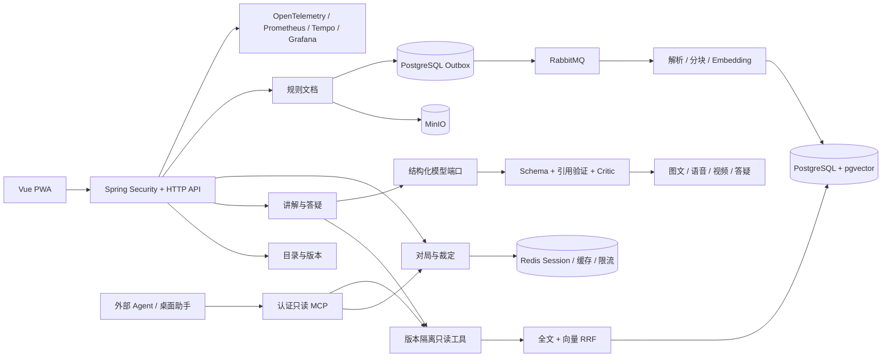

# RulePilot

RulePilot 是一个面向桌游规则书的多媒体规则讲解应用。项目首先解决“读完规则书后，如何把一局游戏从准备到结束完整讲清楚”，规则答疑建立在讲解能力和同一套规则证据之上。

## 产品目标

用户导入规则书并确认游戏版本、扩展和语言后，RulePilot 读取规则正文、示例、图片和表格，生成一套可逐步学习、可追溯到原始页码的完整讲解。

第一优先级是完成一次有效讲解，而不是先提供开放式问答。讲解结束后，用户可以针对不理解的步骤、特殊情况或实际对局问题继续答疑。

## 核心流程

1. 导入规则书
   - 支持 PDF 规则书。
   - 记录游戏名称、版本、语言、扩展和勘误范围。
   - 检查缺页、扫描质量和无法识别的内容，并要求用户确认。
2. 解析和组织规则
   - 按页提取正文、标题、图片、图注、示例和表格。
   - 将规则整理为组件、准备、回合结构、玩家行动、结束条件和计分等主题。
   - 所有规则结论保留来源页码，无法确认的内容不得补写成事实。
3. 生成完整讲解
   - Teaching Agent 针对每个章节在当前规则书版本内执行全文与向量混合检索，再基于检索证据生成结构化讲解。
   - 每个讲解步骤必须引用检索返回的规则 chunk；系统根据 chunk 反查页码并拒绝越权或无引用的模型输出。
   - 先说明游戏目标、获胜条件和学习路线。
   - 介绍组件及其用途。
   - 按玩家人数详细完成 setup，包括公共区域、个人区域、初始资源和先手确定。
   - 解释一轮和一个回合的结构，再逐项讲解可执行动作、限制、费用和结果。
   - 使用示例或首轮演练串联规则，指出容易遗漏的例外和常见错误。
   - 说明游戏结束触发条件、最终计分、奖励、惩罚和同分处理。
   - 最后提供开局检查清单和完整流程回顾。
4. 选择讲解形式
   - 图文讲解：结构化文字配合规则书中的合法图片、局部示意和页码引用。
   - 图文加语音：逐段解说、字幕和阅读进度保持同步，并允许调速和重新播放。
   - 视频讲解：将讲解步骤、示意画面、字幕和解说组合成可跳转章节的视频。
5. 讲解后答疑
   - 用户可以针对当前讲解步骤追问，也可以在实际对局中提问。
   - 答案继承当前游戏、版本、扩展和对局阶段，并提供规则页码。
   - 相同用户再次提出同版本、同扩展范围的问题时，优先返回已确认裁定，不读取答案缓存或调用模型。
   - 证据不足、版本冲突或问题缺少上下文时，必须先澄清而不是猜测。
   - 确认或修订裁定后递增持久化规则数据版本，使旧答案缓存自然失效而无需扫描删除 Redis key。

## 讲解内容结构

每份讲解至少包含以下章节：

1. 这是什么游戏、目标是什么
2. 组件识别与用途
3. Setup 前置条件与逐步摆放
4. 回合、轮次和阶段结构
5. 每种行动的详细步骤
6. 资源、费用、限制和例外
7. 完整回合或首轮示例
8. 游戏结束条件
9. 计分、奖励、惩罚和同分规则
10. 开局检查清单与快速回顾
11. 讲解后的定向答疑入口

## 实现优先级

1. 可靠读取 PDF，并建立页码、文本和图片之间的引用关系。
2. 生成有固定结构、步骤完整、可逐段验证的图文讲解。
3. 加入语音合成、字幕同步和播放控制。
4. 在图文与语音稳定后生成分章节视频。
5. 基于相同规则证据加入讲解内追问和实时对局答疑。

## 技术主线与架构

RulePilot 是一个 Spring Modulith 模块化单体。业务模块通过公开接口和领域事件协作，领域模型不依赖 Spring、JPA、Redis、HTTP、消息队列或模型 SDK。



三条核心技术主线：

1. 可靠规则摄取：流式上传到 MinIO，事务 Outbox 发布 RabbitMQ 分阶段任务，以业务唯一键保证幂等，最终形成带原始页码的规则 chunk 和向量索引。
2. 有证据的 Agent 与 RAG：Teaching Agent 和答疑工作流只调用版本隔离的只读工具，使用 PostgreSQL 全文检索、pgvector 与 RRF 融合结果；模型输出必须通过结构、引用白名单、证据策略、条件 Critic 和执行预算后才能发布。
3. 可运行的产品闭环：Redis 承担会话、可恢复对局上下文、答案缓存和原子限流；已确认裁定绕过模型；PWA 支持安全离线降级，OpenTelemetry、Prometheus、Tempo 和 Grafana 提供端到端可观测性。

## 可复现基线

以下结果均来自 2026-07-18 的本地自制样本和默认 Fake provider，不代表外部大模型或生产硬件性能：

| 验证项 | 实测结果 | 复现命令 |
|---|---:|---|
| 演示规则摄取与讲解 | 5 页、9/9 必需规则章节、12/12 带 chunk 引用的讲解步骤 | `make demo-data` |
| 30 题混合检索 | Recall@5 93.3%（28/30）、MRR 0.519、P95 3.637 ms | `make demo-data` |
| 6 请求、并发 3 的答疑基线 | 冷请求 P95 172.550 ms；热缓存 P95 54.942 ms；热批次模型/Critic 调用 0 次 | `make performance-test` |
| 五页 PDF 与 PostgreSQL 检索 | PDF 到 READY 2 s；全文 0.057 ms；向量 0.223 ms | `make performance-test` |
| 当前统一质量门禁 | 82 个后端测试、11 个前端单元测试、3 个浏览器 E2E | `make verify && make e2e` |

耗时会随机器和容器状态变化；性能命令每次都会输出并保存本机的新结果，不应把上表数字当作固定 SLA。

## 验收标准

- 同一本规则书可以稳定生成从 setup 到计分的完整讲解，不遗漏结束条件和同分处理。
- 每条规则性陈述都能定位到规则书页码；讲解性建议与正式规则明确区分。
- 讲解只使用用户选定的版本和扩展，发现冲突时明确展示冲突来源。
- 用户可以按章节学习、暂停、继续、跳过、返回和展开细节。
- 图文、字幕、语音和视频表达的规则保持一致。
- 图片和文字在移动端与桌面端均可阅读，操作支持键盘和触屏。
- 无法可靠解析或证据不足时返回明确状态，不生成看似完整但未经支持的内容。
- 用户上传的规则书和生成媒体属于本地运行数据，不进入 Git 仓库。

## 技术栈

- 后端：Java 21 编译基线、Java 21/25 CI Matrix、Spring Boot 4.1、Maven Wrapper
- 前端：Vue 3、TypeScript、Vite、Tailwind CSS
- 测试：JUnit、Spring MVC Test、Vitest、Vue Test Utils

## 本地运行

准备本地配置：

```sh
cp .env.example .env
```

启动 PostgreSQL（含 pgvector）、Redis、RabbitMQ、MinIO、Prometheus、Tempo 和 Grafana：

```sh
make compose-up
```

该命令会等待所有依赖通过健康检查，并验证 pgvector、服务连接和持久化卷。停止服务时保留本地数据：

```sh
make compose-down
```

同时启动后端和前端：

```sh
make dev
```

`make dev` 为快速本地开发保留单进程后端。需要验证生产式进程边界时，先启动依赖，再用同一后端制品分别运行 API 和无 Web 端口的 RabbitMQ Worker：

```sh
make compose-up
make dev-split
```

也可以让 Compose 构建同一镜像并启动独立的 `api` 与 `worker` 容器：

```sh
make deployment-up
make deployment-down
```

`api` 角色负责 HTTP、Outbox 发布和队列指标，不消费文档任务；`worker` 角色只消费幂等的解析、切片与 Embedding 阶段，不启动 HTTP 服务或重复发布 Outbox。两种角色仍来自同一个模块化单体制品，不拆分业务代码仓库。

另开一个终端可载入完整演示数据：

```sh
make demo-data
```

该命令使用 `.env` 中的本地管理员账户，经由真实 API 创建 `Lantern Relay` 游戏与版本、生成并上传一份项目自制的五页小型规则书，等待异步解析完成，再创建教学计划和 Teaching Agent 图文讲解。命令可重复执行；生成的 PDF、Cookie 和结果只保存在被 Git 忽略的 `.local/demo/`。完成后终端会输出可直接打开的讲解地址。规则样本原文位于 `examples/lantern-relay-rules.txt`，采用 CC0 许可，不包含商业桌游内容；需要连接其他本地实例时可设置 `DEMO_BASE_URL`、`DEMO_ADMIN_NAME` 和 `DEMO_ADMIN_PASSWORD`。

打开 http://127.0.0.1:5173/login，使用 `.env` 中的本地用户登录。登录会话保存在 Redis；本地提供 `USER` 与具备 `EDITOR`、`ADMIN` 权限的管理员账户，不开放公开注册。

使用管理员账户登录后打开 http://127.0.0.1:5173/catalog，可以创建游戏、版本和扩展，并为扩展选择兼容的游戏版本。

创建版本后打开 http://127.0.0.1:5173/teach，可以上传 50 MiB 以内的 PDF 规则资料。文件会流式保存到 MinIO，在 PostgreSQL 中记录版本与 SHA-256，并在后台通过 PDFBox 按原始页码提取文字；页面通过 SSE 显示实时进度，并把有页码证据的内容初步组织为目标、组件、Setup、回合、行动、结束和计分等讲解章节。用户可以按玩家人数、新手人数和时长创建有明确章节依赖的教学计划，再进入独立图文讲解页逐章学习；该页面支持暂停、继续、跳过、返回、恢复本地进度和展开页码证据，并显示必需章节、引用、Setup、结算和适用范围的质量报告。缺失或尚不可评估的规则证据会持续显示，不会补写无依据内容。

登录后打开 http://127.0.0.1:5173/lessons 可以查看当前账户创建的全部教学计划并重新进入讲解，不依赖某一台设备保存的“最后打开”指针。计划、图文讲解、质量报告、语音与视频接口都会校验计划所有者；其他账户访问同一 `planId` 时返回 404，避免泄露计划是否存在。章节阅读位置仍保存在当前浏览器，服务端资料库不会伪装成跨设备进度同步。

图文讲解由 Teaching Agent 逐章执行版本隔离的混合检索和结构化生成。默认 `TEACHING_PROVIDER=fake` 便于本地无外部费用运行。无论使用哪个模型提供方，引用白名单、长度、章节结构和工具调用预算都由应用层校验。事实 Critic 默认仅审查低置信度回答；设置 `CRITIC_EVALUATION_MODE=true` 可在评测时审查普通回答与讲解步骤，发现无证据主张、矛盾、遗漏例外或过度推断时不会发布该内容。

### 配置大模型 API

使用 `.env` 中的管理员账户登录后打开 http://127.0.0.1:5173/settings/models，可以配置 Gemini、OpenAI、DeepSeek 或其他 OpenAI 兼容服务，并分别指定规则讲解、答疑和事实审校使用的模型。API Key 只提交给后端：响应不返回密钥，前端不把密钥写入浏览器存储，停用供应商会让相关角色切回 Fake。

网页中保存的密钥仅存在于当前后端进程内存，重启后恢复启动配置。这适合本地开发和单进程演示；跨主机访问必须使用 HTTPS。需要重启后自动恢复时，仍可把配置放在被 Git 忽略的根目录 `.env`：

```sh
cp .env.example .env
```

每个业务角色可以独立选择模型：`TEACHING_MODEL_PROVIDER` 用于规则讲解，`ANSWER_MODEL_PROVIDER` 用于答疑，`CRITIC_MODEL_PROVIDER` 用于事实审校。可选值为 `gemini`、`openai`、`deepseek` 或 `compatible`。例如让启动配置全部使用 Gemini：

```dotenv
GEMINI_ENABLED=true
GEMINI_API_KEY=你的_Gemini_API_Key
GEMINI_MODEL=gemini-2.5-flash

TEACHING_PROVIDER=spring-ai
TEACHING_MODEL_PROVIDER=gemini
ANSWER_PROVIDER=spring-ai
ANSWER_MODEL_PROVIDER=gemini
CRITIC_PROVIDER=spring-ai
CRITIC_MODEL_PROVIDER=gemini
```

也可以混合使用多个服务：

```dotenv
GEMINI_ENABLED=true
GEMINI_API_KEY=你的_Gemini_API_Key
OPENAI_ENABLED=true
OPENAI_API_KEY=你的_OpenAI_API_Key
DEEPSEEK_ENABLED=true
DEEPSEEK_API_KEY=你的_DeepSeek_API_Key

TEACHING_PROVIDER=spring-ai
TEACHING_MODEL_PROVIDER=gemini
ANSWER_PROVIDER=spring-ai
ANSWER_MODEL_PROVIDER=deepseek
CRITIC_PROVIDER=spring-ai
CRITIC_MODEL_PROVIDER=openai
```

对于提供 OpenAI 兼容 Chat Completions API 的其他模型服务（包括本地服务），使用通用入口：

```dotenv
COMPATIBLE_MODEL_ENABLED=true
COMPATIBLE_MODEL_API_KEY=服务需要时填写；本地服务可填占位值
COMPATIBLE_MODEL_BASE_URL=http://localhost:11434/v1
COMPATIBLE_MODEL_NAME=你的模型名称
TEACHING_PROVIDER=spring-ai
TEACHING_MODEL_PROVIDER=compatible
```

模型名和服务地址都可覆盖，以供应商账户实际开放的模型为准。启用某个真实提供方但遗漏 Key、地址或模型名时，后端会在启动时明确失败；未启用真实提供方时仍使用 Fake，不会调用外部 API。修改 `.env` 后重新运行 `make dev`，网页保存则立即生效。

讲解内答疑支持拍摄卡牌或选择本地图片。Tesseract.js WebAssembly OCR 在浏览器内识别简体中文和英文，用户核对文字后才会将其整理成当前章节的问题并交给既有 RAG 流程；卡牌照片不会上传到后端或第三方。OCR Worker、核心和语言数据由锁定的 npm 依赖在构建时发布为同源资产，首次识别需要联网加载，默认页面和 PWA 应用外壳不会预载这约 8.7 MiB 的可选资源。

支持 Web Speech API 的浏览器还可以把普通话或英语语音转成文字，再由用户编辑并提交到同一套当前章节 Agent/RAG 答疑流程；不支持时键盘输入保持可用。RulePilot 不保存原始音频，但浏览器或操作系统提供的语音服务可能处理音频，使用前应遵循对应平台的隐私政策。

生产构建可作为 PWA 安装，并缓存应用外壳。断网后仍可打开应用，查看当前教学计划最近的已验证答案和已确认裁定；未缓存的讲解会明确提示需要联网，生成式讲解和答疑不会在离线状态下发起。

每次讲解和答疑都会创建可查询的执行记录，并限制步骤数、Tool/模型调用数、估算 Token 和总耗时。创建响应中的 `assistantRunId` 可用于读取状态步骤、预算消耗和调用审计；运行中的任务也支持由所属用户请求协作式取消。审计只保存操作名、结果、Token 估算和耗时，不保存完整 Prompt 或规则书正文。

后端同时在 `http://127.0.0.1:8080/mcp` 提供同步、无状态的 Streamable HTTP MCP 兼容入口。客户端使用 `.env` 中的本地用户或管理员账户通过 HTTP Basic 认证，可发现并调用 `search_rules`、`get_rule_page`、`get_confirmed_ruling` 和 `get_session_context`。四个工具均为只读能力，并要求传入当前用户拥有的 `sessionId`；规则版本和扩展范围由该对局在服务端确定，客户端不能跨对局指定。HTTP Basic 只适合本机开发，跨主机部署必须使用 HTTPS，并应改接 OAuth 2.0 Resource Server。

后端通过 OpenTelemetry 导出 HTTP 及关键讲解、答疑工作流 Trace，通过 Prometheus 暴露 JVM、HTTP 和业务指标。Grafana 会自动配置 Prometheus、Tempo 与 `RulePilot Overview` 仪表盘；本地默认完整采样，部署时可通过 `TRACING_SAMPLING_PROBABILITY` 调低采样率。统一异常处理返回的 `traceId` 与当前 Trace 一致，可直接用于故障定位。

也可以分别启动：

```sh
cd backend
./mvnw spring-boot:run
```

```sh
cd frontend
npm install
npm run dev
```

默认入口：

- 前端：http://127.0.0.1:5173
- 管理员模型配置：http://127.0.0.1:5173/settings/models
- 后端健康检查：http://127.0.0.1:8080/actuator/health
- MCP：http://127.0.0.1:8080/mcp（HTTP Basic，本地开发）
- PostgreSQL：127.0.0.1:5432
- Redis：127.0.0.1:6379
- RabbitMQ：127.0.0.1:5672（管理界面：http://127.0.0.1:15672）
- MinIO：http://127.0.0.1:9000（控制台：http://127.0.0.1:9001）
- Prometheus：http://127.0.0.1:9090
- Tempo：http://127.0.0.1:3200
- Grafana：http://127.0.0.1:3000（账户来自 `.env` 中的 `GRAFANA_ADMIN_USER` 和 `GRAFANA_ADMIN_PASSWORD`）

## 常用命令

```sh
make help
make bootstrap
make demo-data
make backend-test
make frontend-test
make integration-test
make performance-test
make security-test
make e2e
make compose-up
make compose-down
make verify
```

`make verify` 会检查仓库结构，并执行后端与前端的完整验证流程。

`make performance-test` 会临时启动所需服务和后端，生成一份自制的五页规则 PDF，并测量 PDF 处理、PostgreSQL 全文/向量检索、并发冷答疑和缓存热答疑。结果保存在被 Git 忽略的 `.local/performance/`，临时游戏、规则书、对象和 AssistantRun 会在结束时自动删除。可通过 `PERF_REQUESTS`、`PERF_CONCURRENCY` 和 `PERF_MAX_*` 环境变量调整负载与阈值。

`make security-test` 会审计锁定的前端依赖，并通过 OSV 批量检查后端实际运行时 Maven 依赖；该命令需要联网，发现任何已知漏洞都会失败。

## 仓库结构

```text
backend/    Spring Boot 后端
frontend/   Vue 前端
infra/      本地基础设施配置
scripts/    仓库验证脚本
```

请勿提交真实凭证、用户上传内容、构建产物或未经授权的商业桌游规则书。
