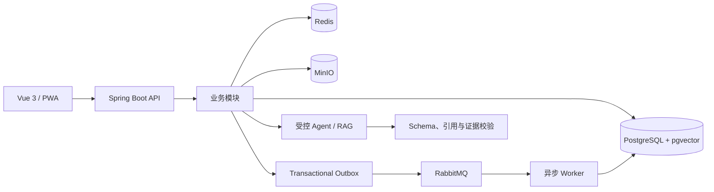

# RulePilot

[](https://github.com/ZhenFan1996/rulepilot/actions/workflows/ci.yml)

RulePilot 是一个证据优先的桌游规则讲解与答疑应用。它读取 PDF 规则书，生成从准备、回合流程到结束计分的分步讲解，并让每条规则结论都可以回到原始页码核验。

## 核心能力

- **完整规则讲解**：围绕游戏目标、组件、准备、行动、结束与计分组织可逐章阅读的教程。
- **图文证据定位**：结合页面文字、图片与局部区域展示出处，不把模型描述当作规则证据。
- **规则内追问**：在当前章节或桌边场景中继续提问；证据不足时明确追问或拒答。
- **可恢复的异步流程**：规则书解析、讲解生成与视觉增强支持进度展示、失败诊断和恢复。
- **受控 AI 工作流**：限制模型工具、调用次数、Token 与超时，并在发布前校验结构和引用。
- **本地优先开发**：默认使用确定性的 Fake Provider，运行测试和演示无需真实模型或付费 API。

## 技术栈

| 层级 | 技术 |
|---|---|
| 后端 | Java 21、Spring Boot 4.1、Spring Modulith、Spring AI |
| 前端 | Vue 3、TypeScript、Vite、Tailwind CSS |
| 数据 | PostgreSQL、pgvector、Redis、MinIO |
| 异步任务 | RabbitMQ、Transactional Outbox |
| 可观测性 | OpenTelemetry、Prometheus、Tempo、Grafana |
| 测试 | JUnit、Testcontainers、Vitest、Playwright、ArchUnit |

## 快速开始

### 环境要求

- Java 21
- Node.js 24
- Docker 与 Docker Compose
- GNU Make

### 启动项目

```sh
git clone https://github.com/ZhenFan1996/rulepilot.git
cd rulepilot
cp .env.example .env
cd frontend && npm ci && cd ..
make compose-up
make dev
```

启动完成后访问：

- Web 应用：<http://127.0.0.1:5173>
- 后端健康检查：<http://127.0.0.1:8080/actuator/health>
- Grafana：<http://127.0.0.1:3000>

按 `Ctrl+C` 停止前后端开发进程，使用以下命令停止基础设施并保留本地数据：

```sh
make compose-down
```

默认配置使用 Fake Provider，不会调用外部模型。真实模型、Embedding、BoardGameGeek 和基础设施选项均记录在 [.env.example](.env.example) 中；不要提交 `.env` 或任何真实凭证。

## 体验完整流程

服务启动后，可载入项目自制、采用 CC0 许可的演示规则书：

```sh
make demo-data
```

命令会通过真实 API 完成游戏创建、PDF 上传、异步解析和讲解生成，并在终端输出讲解地址。演示产物仅写入被 Git 忽略的 `.local/demo/`。

## 架构

RulePilot 采用 Spring Modulith 模块化单体。领域代码保持纯 Java，业务模块通过公开接口和领域事件协作，外部系统经由端口与适配器接入。



详细的产品边界、模块职责和 AI 证据策略见：

- [项目蓝图](docs/PROJECT_BLUEPRINT.md)
- [AI Agent 设计](docs/AI_AGENT_DESIGN.md)
- [AI 泛化准则](docs/AI_GENERALIZATION_GUIDELINES.md)
- [UX 设计系统](docs/UX_DESIGN_SYSTEM.md)

## 常用命令

| 命令 | 用途 |
|---|---|
| `make help` | 查看全部仓库命令 |
| `make bootstrap` | 检查仓库基础结构 |
| `make dev` | 启动后端与前端 |
| `make dev-stop` | 清理本项目遗留的开发进程 |
| `make compose-up` / `make compose-down` | 启停本地基础设施 |
| `make demo-data` | 载入自制演示数据 |
| `make backend-test` | 运行后端测试 |
| `make frontend-test` | 运行前端检查与测试 |
| `make integration-test` | 运行基础设施集成测试 |
| `make e2e` | 运行 Playwright 端到端测试 |
| `make product-eval` | 运行普通玩家产品评测 |
| `make verify` | 运行提交前完整质量门禁 |

生产式 API/Worker 拆分、部署与性能/安全检查可通过 `make help` 查看对应命令。

## 仓库结构

```text
backend/    Spring Boot 模块化单体
frontend/   Vue 3 Web 应用
infra/      Compose 与基础设施配置
scripts/    开发、验证、评测和部署脚本
examples/   自制演示与评测数据
docs/       产品、架构、路线图和学习记录
```

## 开发约定

开始修改前请阅读 [AGENTS.md](AGENTS.md) 和 [编码规范](docs/CODING_STANDARDS.md)。当前计划与执行证据记录在 [ROADMAP](docs/roadmap/ROADMAP.md) 和 [EXECUTION_STATE](docs/roadmap/EXECUTION_STATE.md)。

提交代码前运行：

```sh
make verify
```

请勿提交真实凭证、用户上传内容、生成模型数据或未经授权的商业桌游规则书。
